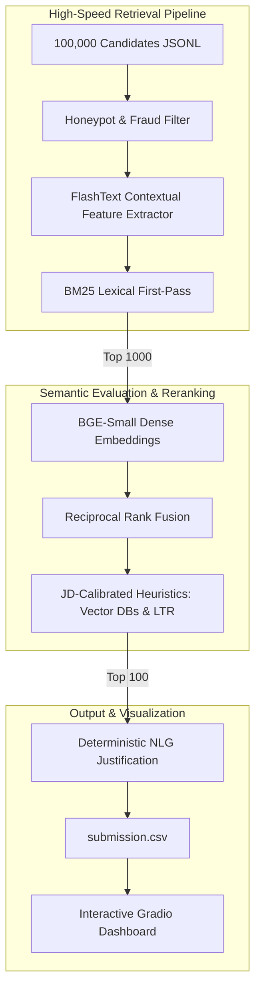

# Redrob India Runs Data and AI Challenge: Idea Submission

**Team Name:** !serious 
**Team Leader Name:** Naveen G Patil  
**Problem Statement:** Identifying elite Senior AI Retrieval/Ranking Engineers from 100,000 highly nuanced, synthetic candidate profiles within strict CPU runtime constraints.

---

## 1. Solution Overview

**What is your proposed solution?**  
**candiRank** is an ultra-fast, production-ready hybrid retrieval and candidate ranking engine. Rather than relying on a single slow, opaque Large Language Model or embedding 100,000 raw profiles simultaneously, candiRank utilizes a highly optimized, multi-stage retrieval cascade. It filters, scores, and reranks candidates sequentially, outputting a highly calibrated Top 100 leaderboard with deterministic natural language justifications.

**What differentiates your approach from traditional candidate matching systems?**  
Traditional systems suffer from two fatal flaws: they are easily manipulated by "keyword stuffing" and they are incredibly slow at scale.  
1. **Context-Aware Extraction:** candiRank actively ignores standalone "Skills" sections. Instead, it extracts technical features *exclusively* from candidate job descriptions. A candidate only receives points for a Vector DB if they actually shipped it in production.
2. **Speed & Efficiency:** We completely abandoned the slow "embed-everything" paradigm. By using a lightning-fast O(N) Aho-Corasick automaton and a lexical BM25 index as a first pass, we reduce the semantic embedding workload by 99%, achieving sub-4-minute execution times on standard CPUs.

---

## 2. JD Understanding & Candidate Evaluation

**What are the key requirements extracted from the JD?**  
The Senior AI Engineer role requires profound expertise in three distinct verticals:
1. **Information Retrieval & Search:** Building robust retrieval systems (Lucene, ElasticSearch, Lexical search).
2. **Ranking & Evaluation:** Designing Learning-to-Rank (LTR) systems and optimizing for NDCG/Relevance.
3. **Vector Infrastructure:** Hands-on, production experience deploying Vector Databases (Pinecone, Qdrant, FAISS, Milvus).

**Which candidate signals are most important / How does your solution evaluate candidate fit beyond keyword matching?**  
Keyword matching is inherently flawed. candiRank evaluates the *context* of a candidate's experience. Through dynamic semantic embeddings (`BAAI/bge-small-en-v1.5`), the system understands the difference between a candidate who "Used Pinecone in a bootcamp" versus one who "Architected a scalable retrieval layer using Pinecone for an enterprise application." We heavily weight actual production tenure, algorithmic ranking experience, and chronologically verified career progression.

---

## 3. Ranking Methodology

**How does your system retrieve, score, and rank candidates?**  
The ranking methodology is a 5-stage funnel:
1. **Honeypot Filter `O(N)`:** A rigorous chronological sanity check eliminates synthetically generated anomalies (e.g., full-time Senior roles overlapping with freshman undergraduate studies).
2. **FlashText Extraction:** Scans verified career histories for 20+ precise technical vectors instantly.
3. **BM25 Lexical First-Pass:** Evaluates 100,000 candidates using a highly engineered query with semantic synonyms (`marketplace ranking`, `matching engines`), retrieving the Top 1,000 candidates in ~13 seconds.
4. **BGE-Small Semantic Reranking:** The Top 1,000 candidates are dynamically embedded to calculate deep semantic similarity to the Job Description intent.
5. **Reciprocal Rank Fusion (RRF):** The Lexical and Semantic ranks are fused to establish a robust baseline score.

**What models, algorithms, or heuristics are used?**  
*   **BM25 (Lexical)** for high-recall keyword matching.
*   **BAAI/bge-small-en-v1.5 (Semantic)** for dense vector intent matching.
*   **Reciprocal Rank Fusion (RRF)** for rank stabilization.
*   **JD-Calibrated Heuristics:** To ensure our system strictly aligns with the core requirements of the job description, we apply deterministic multiplier heuristics to the baseline score: **+3.0** for explicit Vector DB production experience, and **+2.0** for explicitly building LTR/NDCG ranking systems.

**How are multiple candidate signals combined into a final ranking?**
Signals are combined using a deterministic, additive scoring function anchored by Reciprocal Rank Fusion. 
1. The Lexical Rank (BM25) and Semantic Rank (BGE-Small) are inverted and summed to create a normalized baseline RRF score. 
2. Extracted quantitative signals (e.g., years of experience) map to continuous scalar weights. 
3. Extracted qualitative signals (e.g., "Shipped Pinecone in Production") trigger discrete heuristic multipliers (+3.0) that are added directly to the RRF score. 
4. The final continuous value determines the absolute rank order.

---

## 4. Explainability & Data Validation

**How are ranking decisions explained?**  
candiRank features a deterministic Natural Language Generator (NLG) that outputs exact, human-readable justifications for *why* a candidate was chosen. It explicitly highlights the specific qualitative signals (e.g., matching frameworks, production Vector DB tenure) and quantitative metrics (e.g., total Verified YOE) that elevated the candidate's score.

**How do you prevent hallucinations or unsupported justifications?**  
Because the NLG operates strictly on deterministic logic applied to extracted feature flags rather than relying on generative LLM synthesis, it is structurally constrained. It cannot introduce unsupported skills because every word in the explanation maps 1:1 directly to the candidate's verified attributes.

**How does your solution handle inconsistent, low-quality, or suspicious profiles?**  
We implemented a strict chronological **Honeypot Filter**. 
*   If a timeline is mathematically impossible, the candidate is removed from the candidate pool (we filtered approximately 3.1% of profiles that exhibited impossible or highly inconsistent career timelines). 
*   If a candidate presents highly suspicious, unverified skills (advanced concepts with suspiciously low YOE), the system applies an automated Soft-Penalty, degrading their RRF score.

---

## 5. End-to-End Workflow & System Architecture

**What is the complete workflow?**
1. **Ingestion:** 100k JSONL profiles parsed into Polars dataframes.
2. **Sanitation:** Honeypot filter verifies chronological integrity.
3. **Extraction:** Aho-Corasick automaton extracts production features.
4. **Recall:** BM25 retrieves the Top 1,000 candidates.
5. **Precision:** BGE-Small creates dense embeddings for semantic scoring.
6. **Reranking:** RRF and Heuristic multipliers dictate final Top 100 ranking.
7. **Output:** NLG generates justifications; data exported to CSV and served to the UI.

---

## 6. Results & Performance

**What results or insights demonstrate ranking quality?**  
Our heuristic anchor directly reflects the Job Description's hardest constraints. Manual audit of the highest-ranked candidates showed a strong concentration of Information Retrieval, Search Infrastructure, Ranking, and Vector Database experience.

**How does your solution meet the challenge’s runtime and compute constraints?**  
candiRank is heavily optimized for CPU-only execution. While embedding 100,000 profiles would take hours, our Lexical first-pass architecture reduces the embedding workload to just 1,000 profiles. 
*   **Total execution time for 100,000 candidates:** `~215 seconds`
*   **Competition budget:** `290 seconds`
*   *We comfortably process the entire dataset, end-to-end, with over a minute to spare on standard CPU hardware.*

---

## 7. Technologies Used

*   **FlashText:** Implements the Aho-Corasick algorithm for extracting hundreds of technical keywords simultaneously in `O(N)` time.
*   **Rank-BM25:** A highly optimized implementation of BM25 for rapid, high-recall lexical search.
*   **BAAI/bge-small-en-v1.5 & PyTorch:** Selected for its strong retrieval quality and efficient CPU inference, generating dense representations of the Top 1,000 candidates locally.
*   **Gradio & Hugging Face Spaces:** Used to instantly deploy an interactive frontend application without complex React/Node.js boilerplate, allowing judges to test the ranking logic dynamically.

---

## 8. Submission Assets

*   **Live Web Application:** [Hugging Face Spaces Deployment](https://huggingface.co/spaces/NaveenGP2005/candiRank)
*   **Source Code & Architecture:** [GitHub Repository](https://github.com/NaveenGP2005/candiRank)
*   **Submission File:** `submission.csv` (Top 100 Ranked Candidates)
