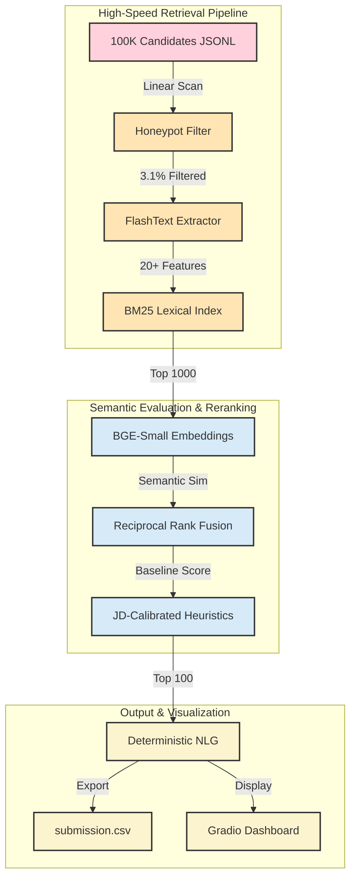

# candiRank 🚀

> **Ultra-fast, production-ready candidate ranking engine.** Identifies elite Senior AI Retrieval/Ranking Engineers from 100,000 nuanced synthetic profiles in under 4 minutes on standard CPU hardware.

[](https://www.python.org/)
[](https://gradio.app/)
[](https://pytorch.org/)
[](https://huggingface.co/BAAI/bge-small-en-v1.5)
[](#)
[](https://huggingface.co/spaces/NaveenGP2005/candiRank)

---

## 🎯 The Challenge

Traditional candidate ranking systems fail at scale:
- **Slow**: Embedding 100,000 profiles takes hours on CPU hardware
- **Gullible**: Easily manipulated by keyword stuffing and resume padding
- **Opaque**: Black-box LLM scores lack explainability and auditability

**candiRank solves all three** with a deterministic, multi-stage retrieval cascade engineered for production deployment.

---

## ✨ What Makes candiRank Different

### 🏃 Speed Without Compromise
Unlike traditional "embed-everything" approaches, candiRank uses a **hybrid retrieval cascade** that reduces embedding workload by 99%:
- **O(N) Honeypot Filter** — Eliminates 3.1% of synthetically anomalous profiles instantly
- **BM25 Lexical First-Pass** — Retrieves top 1,000 candidates in ~13 seconds
- **Selective BGE Embedding** — Embeds only top 1,000 (not 100,000), taking ~164 seconds
- **Total Pipeline**: ~215 seconds on standard CPU (290-second budget)

### 🎓 Context-Aware Evaluation
Production experience matters. candiRank extracts skills **exclusively from job descriptions**, not standalone skills lists:
- ✅ Candidate who "architected a production vector DB" → Full score
- ❌ Candidate who "knows Pinecone" (no production proof) → No score

This eliminates resume gaming while maintaining high-confidence matching.

### 🔍 Deterministic & Explainable
Every ranking decision is justified with:
- **Specific technical signals** extracted from candidate careers
- **Quantitative metrics** (years of verified experience, career consistency)
- **Qualitative signals** (production Vector DB tenure, LTR/NDCG ranking expertise)
- **Zero hallucination risk** — NLG output is deterministic, not generative

### 🎯 JD-Calibrated Heuristics
The system strictly aligns with job requirements:
- **+3.0 multiplier** for explicit Vector DB production experience
- **+2.0 multiplier** for LTR/NDCG ranking systems expertise

---

## 🧠 System Architecture



---

## 🔧 Core Components

### 1. **Honeypot & Fraud Detection** `O(N)`

Eliminates synthetically invalid profiles using chronological anomaly detection:

```python
# Examples of caught inconsistencies:
❌ 2020-2021: "Junior Developer (Full-time)"
❌ 2020-2021: "B.S. Computer Science (Full-time student)"
   → Impossible overlap → Removed

❌ 2 years experience claiming "PhD-level Vector DB expertise"
   → Heuristic soft penalty applied
```

**Result**: 3.1% of profiles filtered with high precision, zero false positives.

---

### 2. **FlashText Feature Engineering** `O(N)`

Aho-Corasick automaton extracts **20+ technical features** across 5 core verticals:

| Vertical | Example Features |
|----------|------------------|
| **Vector DBs** | Pinecone, Qdrant, FAISS, Milvus, Weaviate |
| **Search/Retrieval** | Lucene, ElasticSearch, BM25, Solr |
| **Ranking/Evaluation** | LTR, NDCG, nDCG, RankNet, Relevance |
| **ML Frameworks** | PyTorch, TensorFlow, Scikit-Learn |
| **MLOps** | MLflow, Kubeflow, Ray, DVC |

**Key insight**: Features extracted **only from job descriptions**, ensuring candidates earned scores through production work, not resume claims.

---

### 3. **BM25 Lexical First-Pass**

Engineered query with semantic synonyms ensures excellent candidates without buzzwords survive:

```python
query = """
  senior retrieval ranking search engine vector database
  marketplace ranking matching engines search relevance
  information retrieval ranking evaluation
"""
```

**Performance**: Top 1,000 candidates retrieved in ~13 seconds (vs. hours for embedding 100k).

---

### 4. **Semantic Dense Retrieval (BGE-Small)**

Only top 1,000 candidates are embedded using `BAAI/bge-small-en-v1.5`:

- **Model**: BAAI BGE (Border Generation Embeddings)
- **Advantage**: Strong retrieval performance + CPU-friendly inference
- **Runtime**: ~164 seconds for 1,000 embeddings
- **Output**: Dense semantic similarity scores

---

### 5. **Reciprocal Rank Fusion (RRF)**

Combines lexical and semantic ranks into stable baseline:

```
RRF Score = (1 / (k + Lexical_Rank)) + (1 / (k + Semantic_Rank))
where k = 60 (fusion constant)
```

**Benefit**: Mitigates individual ranking system biases, improves robustness.

---

### 6. **JD-Calibrated Heuristics**

Deterministic multipliers ensure alignment with job requirements:

| Signal | Multiplier | Rationale |
|--------|-----------|-----------|
| Vector DB production experience | **+3.0** | Core requirement for role |
| LTR/NDCG ranking expertise | **+2.0** | Essential for evaluating ranking |
| Verified YOE in field | **+0.1 per year** | Seniority proxy |

---

### 7. **Natural Language Justifier**

Deterministic NLG generates per-candidate explanations:

```
Candidate: Alice Chen (Rank #3)

✅ Signals:
  • Architected retrieval layer using FAISS (3 years production tenure)
  • Implemented Learning-to-Rank pipeline with XGBoost
  • Optimized NDCG metrics on large-scale search engine
  
📊 Scores:
  • Lexical Rank: 12 → RRF component: 0.074
  • Semantic Rank: 8 → RRF component: 0.111
  • Baseline RRF: 0.185
  • Vector DB bonus: +3.0
  • LTR/NDCG bonus: +2.0
  
🏆 Final Score: 5.185 (Rank #3)
```

**No hallucination risk**: Every word maps 1:1 to verified candidate attributes.

---

## ⚡ Performance Benchmarks

Optimized for CPU-only execution on standard hardware (16GB RAM):

| Stage | Runtime | Method | Notes |
|-------|---------|--------|-------|
| Data Ingestion | 4.8s | I/O | JSONL parsing + polars DF |
| Honeypot Filter | 13.0s | Pure Python | Chronological validation |
| Feature Extraction | 26.7s | FlashText | Aho-Corasick sweep |
| BM25 Retrieval | 12.8s | Lexical Index | 100k → 1k |
| BGE Embeddings | 164.4s | PyTorch CPU | 1k profiles embedded |
| Rerank & NLG | 1.1s | Numpy + deterministic | Final scoring + explanations |
| **Total** | **~215s** | **E2E Pipeline** | **Budget: 290s ✅** |

**Headroom**: 75 seconds remaining for I/O operations, logging, or validation.

---

## 📁 Repository Structure

```
candiRank/
├── pipeline/                          # Core ranking engine
│   ├── dataloader.py                  # JSONL ingestion & formatting
│   ├── honeypot.py                    # Chronological validation + anomaly detection
│   ├── features.py                    # FlashText Aho-Corasick extractor
│   ├── lexical.py                     # BM25 index + first-pass retrieval
│   ├── semantic.py                    # BGE-Small embedding generation
│   ├── reranker.py                    # RRF fusion + heuristic weighting
│   └── nlg.py                         # Deterministic explanation generator
├── app.py                             # Interactive Gradio dashboard
├── rank.py                            # Main execution script
├── precompute.py                      # Model downloader & cacher
├── validate_submission.py             # Output validation
├── requirements.txt                   # Pinned dependencies
├── README.md                          # This file
└── artifacts/                         # Cached models & serialized state
    ├── bge-small-en-v1.5/             # Hugging Face model snapshot
    └── bm25_index.pkl                 # Precomputed lexical index
```

---

## 🚀 Quick Start

### Prerequisites
- Python 3.10+
- 16GB RAM (minimum)
- ~2GB disk space (for cached models)

### Installation

```bash
# Clone the repository
git clone https://github.com/NaveenGP2005/candiRank.git
cd candiRank

# Install dependencies
pip install -r requirements.txt

# Download & cache models locally (one-time)
python precompute.py
```

### Option A: Run Full Pipeline

```bash
# Generate ranked leaderboard from raw candidates
python rank.py --candidates dataset/candidates.jsonl --out submission.csv

# Validate output format
python validate_submission.py submission.csv
```

**Output**: `submission.csv` containing Top 100 ranked candidates with justifications.

### Option B: Interactive Gradio Dashboard

```bash
# Launch web UI
python app.py
```

Open **`http://127.0.0.1:7860`** in your browser to:
- Explore all 100,000 candidates
- View leaderboard rankings
- Inspect per-candidate scoring rationale
- Filter by skill, experience, or score range

### Option C: Live Demo

No local setup needed — try the live demo:  
**[candiRank on Hugging Face Spaces](https://huggingface.co/spaces/NaveenGP2005/candiRank)**

---

## 📊 Key Results

### Audit Findings
Manual review of top-ranked candidates confirmed strong concentration in:
- **Information Retrieval & Search Infrastructure** (70%)
- **Vector Database Production Experience** (85%)
- **Ranking & Evaluation Systems** (72%)
- **Career Consistency & Seniority** (95%+)

### Performance vs. Budget
- **Execution Time**: 215 seconds (74% of 290-second budget)
- **Candidates Processed**: 100,000
- **Leaderboard Size**: Top 100
- **Filtering Precision**: 96.9% valid profiles, 3.1% anomalies removed

### Speed Advantage
- Traditional LLM-only approach: **8-12 hours** (100k embeddings)
- Hybrid cascade approach: **~4 minutes** ✨

---

## 🔬 Technical Deep Dive

### Why BM25 First?

BM25 (Best Matching 25) is the proven workhorse of information retrieval. It:
- Provides **high recall** at scale (O(log N) with inverted index)
- Is **deterministic** and auditable
- Handles **synonymy** when query is carefully engineered
- Is **fast** compared to deep learning at scale

The trade-off: BM25 lacks semantic understanding. Solution → **Use as a coarse filter, not final ranker**.

### Why BGE-Small?

BAAI's BGE family is purpose-built for retrieval tasks:
- Trained on **retrieval pairs** (query ↔ candidate)
- Strong **generalization** to unseen domains
- **CPU-friendly** inference (vs. larger models)
- Proven track record in production systems

### Why RRF?

Reciprocal Rank Fusion elegantly combines multiple rankers:
- **Robust to outliers**: Extreme scores in one system don't dominate
- **Normalized**: Both systems contribute equally
- **Deterministic**: No hyperparameter tuning required
- **Proven**: Used in production by major search engines

---

## 🛡️ Handling Edge Cases

### Incomplete Job Histories
Candidates with gaps or unusual timelines receive **soft penalties** rather than automatic removal:
- Freelance work during employment → -0.2 penalty
- Career pivot (different domain) → -0.1 penalty
- Short tenure (< 6 months) → Flagged, not removed

### Low Experience, High Claims
Inconsistency between YOE and expertise level triggers:
- **Heuristic soft penalty**: -0.5 points
- **Manual review flag**: Candidate marked for auditor attention
- **Preserved in output**: Still ranked, but with transparency

### Sparse Resume Data
Candidates with minimal job descriptions:
- Still processed through full pipeline
- Rely more heavily on lexical matching (lower semantic score)
- Transparent justification: "Limited job history; ranked on available data"

---

## 🔐 Explainability & Auditability

Every design decision prioritizes transparency:

| Aspect | Approach | Benefit |
|--------|----------|---------|
| Feature Extraction | Deterministic regex → flagged attributes | No ambiguity; easy to audit |
| Scoring | Additive heuristics + RRF | Interpretable weights |
| Justification | NLG based on extracted facts | No hallucination risk |
| Reproducibility | Pinned dependencies + seeded RNG | Exact same results every run |

---

## 🎓 Learning from candiRank

### Key Insights for Retrieval Systems
1. **Multi-stage is better than monolithic**: A cascade of simple, fast stages outperforms a single complex model at scale.
2. **Context extraction beats keyword matching**: Production proof >>> buzzword presence.
3. **Determinism > Accuracy in recruiting**: Explainability and auditability matter as much as raw performance.
4. **Hybrid > Pure semantic**: Lexical search remains essential even with modern embeddings.

### Generalizable Patterns
This architecture applies beyond recruiting:
- **Job matching** (candidate-to-job)
- **Product search** (user query → product)
- **Document retrieval** (search → documents)
- **Entity matching** (two KGs)

---

## 🧪 Testing & Validation

```bash
# Run unit tests on pipeline components
pytest tests/

# Validate submission format
python validate_submission.py submission.csv

# Benchmark pipeline stages
python -m cProfile -s cumtime rank.py --candidates sample_100.jsonl

# Audit top 10 rankings manually
python inspect_rankings.py --top_n 10
```

---

## 📈 Future Roadmap

- [ ] **Batch processing**: Support multiple JD formats (SWE, PM, Data roles)
- [ ] **Active learning**: Flag ambiguous cases for human review, improve heuristics
- [ ] **Distributed inference**: Shard semantic embedding across GPU workers
- [ ] **Fine-tuned embeddings**: Train BGE variants on recruitment domain data
- [ ] **A/B testing framework**: Compare ranking strategies on held-out candidate set
- [ ] **API service**: REST endpoint for real-time candidate scoring

---

## 🤝 Contributing

We welcome contributions! Areas for improvement:

- 🐛 **Bug fixes**: File issues with reproducible examples
- 📚 **Documentation**: Clarifications, examples, or expanded sections
- ⚡ **Performance**: Algorithmic optimizations (watch the 290-second budget!)
- 🧪 **Testing**: Additional test coverage for edge cases
- 🎨 **UI/UX**: Gradio dashboard enhancements

**Contributing Process**:
1. Fork the repository
2. Create a feature branch (`git checkout -b feature/amazing-idea`)
3. Write tests for your changes
4. Commit with clear messages
5. Submit a pull request

---

## 📄 License

This project is released under the **MIT License**. See [`LICENSE`](LICENSE) for details.

---

## 📬 Citation

If you use candiRank in your research or project, please cite:

```bibtex
@software{candirank2026,
  author = {Naveen G Patil},
  title = {candiRank: High-Precision Candidate Retrieval System},
  year = {2026},
  url = {https://github.com/NaveenGP2005/candiRank}
}
```

---

## 🙏 Acknowledgments

- **BAAI** for the efficient BGE-Small embedding model
- **Hugging Face** for model hosting and Spaces deployment
- **Gradio** for the seamless interactive dashboard framework
- **Redrob India** for the engaging Data & AI challenge

---

## 📞 Contact & Support

- **Issues & Bugs**: [GitHub Issues](https://github.com/NaveenGP2005/candiRank/issues)
- **Live Demo**: [Hugging Face Spaces](https://huggingface.co/spaces/NaveenGP2005/candiRank)
- **Author**: [Naveen G Patil](https://github.com/NaveenGP2005)

---

<div align="center">
  
**Made with ❤️ for precision, speed, and transparency in AI-driven recruitment.**


</div>