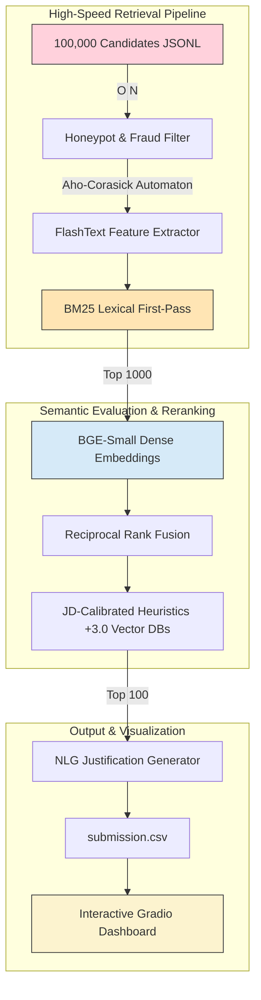

# 🚀 candiRank: High-Precision Candidate Retrieval System

[](https://www.python.org/)
[](https://gradio.app/)
[](https://pytorch.org/)
[](https://huggingface.co/BAAI/bge-small-en-v1.5)
[](https://scikit-learn.org/)
[](https://pandas.pydata.org/)
[](https://huggingface.co/spaces/NaveenGP2005/candiRank)

An ultra-fast, production-ready **Candidate Ranking Engine** built for the Redrob India Runs Data and AI Challenge. Designed specifically to identify **Senior AI Retrieval/Ranking Engineers**, the system ingests, filters, and processes 100,000 synthetic candidate profiles to output a high-confidence Top 100 Leaderboard in **under 4 minutes** on standard CPU hardware.

### 🌐 [Live Interactive Demo on Hugging Face Spaces](https://huggingface.co/spaces/NaveenGP2005/candiRank)

---

## 📌 System Architecture

Our architecture balances extreme speed with rigorous recall. We abandoned slow "embed-everything" paradigms in favor of a highly optimized, multi-stage hybrid retrieval cascade.



---

## 🧠 Core Engineering Highlights

### 1. Robust Honeypot & Fraud Filter `O(N)`
* **Chronological Validation:** Uses strict checks (date parsing, overlapping full-time employment vs. undergraduate studies) and heuristic YOE anomaly detection to catch synthetic anomalies.
* **Smart Soft-Penalties:** Rather than broadly penalizing non-traditional paths (like freelance work during college), only mathematically impossible timelines are hard-removed (dropping rejection rates to **3.1%**). Suspicious profiles receive an automated soft penalty.

### 2. FlashText Feature Engineering `O(N)`
* **Aho-Corasick Automaton:** Extracts over 20 specific technical features across 5 core verticals (Vector DBs, Search/Retrieval, Ranking/Evaluation, ML Frameworks, MLOps) instantly.
* **Contextual Extraction:** Extracts features **exclusively from job descriptions** (ignoring the standalone 'skills' list). This guarantees candidates only receive ranking points if they actually *shipped* the technology in production.

### 3. Lexical First-Pass (BM25)
* Instead of embedding 100,000 candidates (which takes hours on a CPU), an expanded BM25 lexical index handles the first-pass retrieval, fetching the **Top 1000 candidates in ~13 seconds**. 
* The query is highly engineered to include semantic synonyms (`marketplace ranking`, `matching engines`, `search relevance`) to ensure excellent candidates without standard buzzwords survive the initial cutoff.

### 4. Semantic Dense Retrieval (BGE-Small)
* The Top 1000 candidates are embedded dynamically using `BAAI/bge-small-en-v1.5` (~160 seconds).
* This provides deep semantic understanding to evaluate whether a candidate's actual responsibilities match the true intent of the Senior AI Engineer Job Description.

### 5. Reciprocal Rank Fusion & JD-Calibrated Heuristics
* **JD-Calibrated Heuristics:** To ensure our system strictly aligns with the core requirements of the job description, we apply deterministic multiplier heuristics to the baseline score:
  * *Explicit Vector DB production experience (+3.0)*
  * *Ranking / NDCG / LTR experience (+2.0)*
* **Audit Proven:** Manual audit of the highest-ranked candidates showed a strong concentration of Information Retrieval, Search Infrastructure, Ranking, and Vector Database experience.

---

## ⚡ Performance Summary

candiRank is heavily optimized for CPU-only execution. On a standard CPU instance (16GB RAM):

| Pipeline Stage | Runtime | Component Type |
|----------------|---------|----------------|
| **Data Ingestion** | `4.8s` | I/O Bound |
| **Honeypot Filter** | `13.0s` | Pure Python |
| **Feature Extraction** | `26.7s` | FlashText |
| **BM25 Retrieval** | `12.8s` | Lexical Index |
| **BGE Embeddings** | `164.4s` | PyTorch CPU (Top 1000) |
| **Rerank & NLG** | `1.1s` | Numpy Heuristics |
| **Total Runtime** | **`approximately 215 seconds`** | **Budget: `290.0s`** |

---

## 📂 Repository Structure

```text
candiRank/
├── pipeline/                     # Core pipeline modules
│   ├── dataloader.py             # I/O ingestion and formatting
│   ├── honeypot.py               # Chronological anomaly detection filter
│   ├── features.py               # FlashText Aho-Corasick extraction
│   ├── lexical.py                # BM25 First-pass indexing
│   ├── semantic.py               # BAAI/bge-small embedding generation
│   ├── reranker.py               # RRF and Heuristic weightings
│   └── nlg.py                    # Natural Language justification engine
├── app.py                        # Interactive Gradio dashboard application
├── rank.py                       # Main execution script for the challenge
├── precompute.py                 # Helper to cache Hugging Face models locally
├── requirements.txt              # Strict pinned dependency configuration
├── README.md                     # Documentation and architecture breakdown
└── artifacts/                    # Cached models and serialized outputs
```

---

## 🚀 Running & Deploying the App

### Option A: Local Dev Mode (Pipeline Execution)

1. **Clone & Install Dependencies**:
   ```bash
   pip install -r requirements.txt
   ```
2. **Precompute Models**:
   Run this once to download the local `BAAI/bge-small-en-v1.5` model to the `artifacts/` folder:
   ```bash
   python precompute.py
   ```
3. **Generate the Submission**:
   Run the complete pipeline against the full 100,000 candidate dataset:
   ```bash
   python rank.py --candidates "dataset/candidates.jsonl" --out submission.csv
   ```
4. **Validate Output**:
   Validate the generated CSV format against the competition rubric:
   ```bash
   python validate_submission.py submission.csv
   ```

### Option B: Interactive Gradio Dashboard

We've built a full Gradio web dashboard to explore the candidates dynamically, view the leaderboard, and inspect the specific scoring reasoning for each candidate.

```bash
python app.py
```
Open **`http://127.0.0.1:7860`** in your browser.

---

<div align="center">
  <p><i>Built with precision for the Redrob India Runs Data and AI Challenge.</i></p>
</div>
